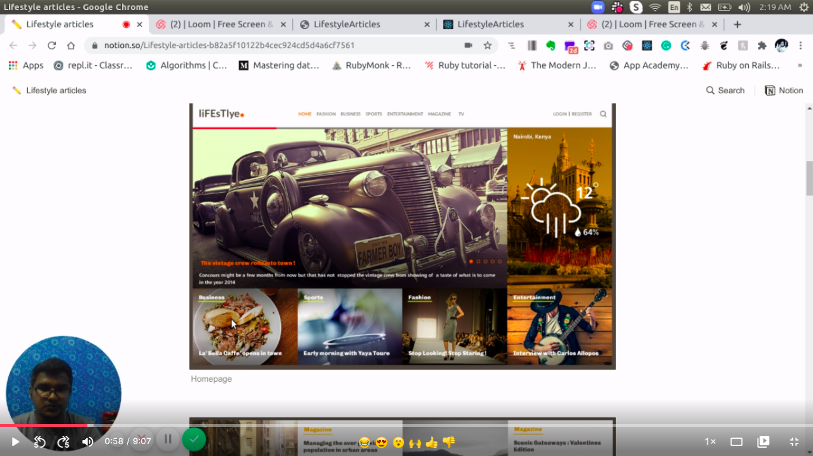
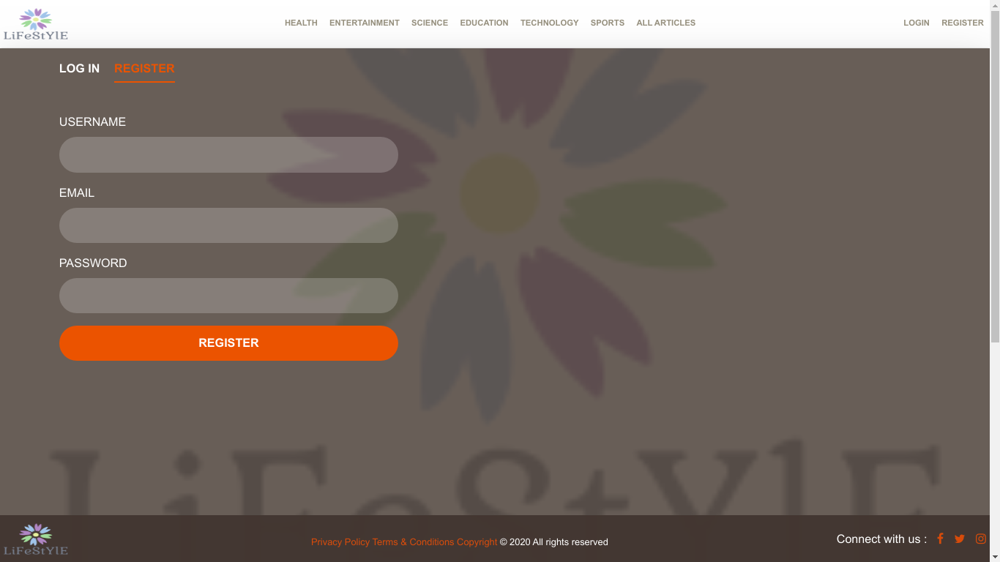
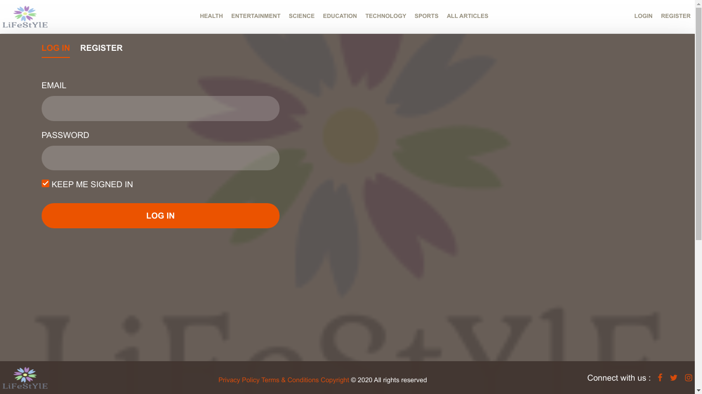
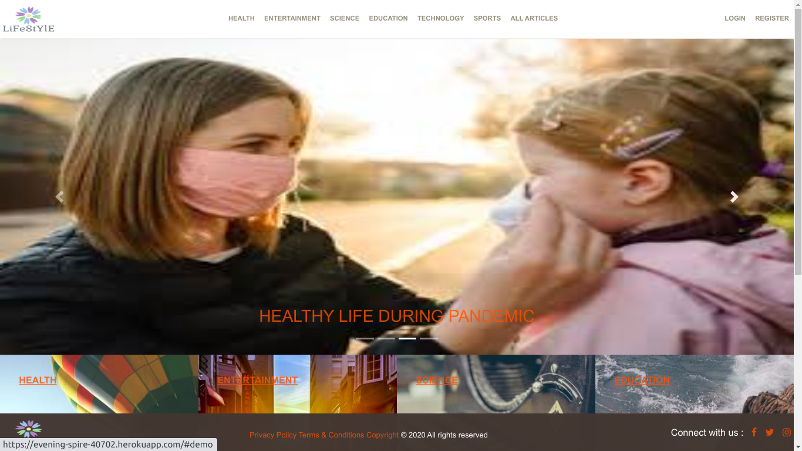
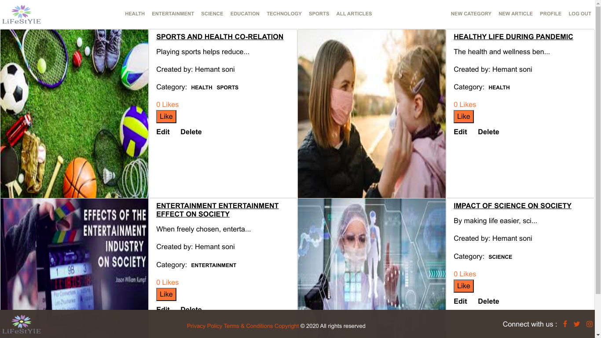
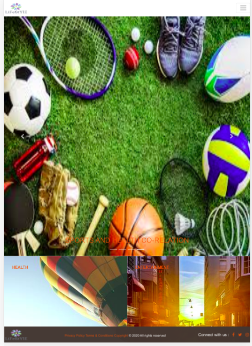
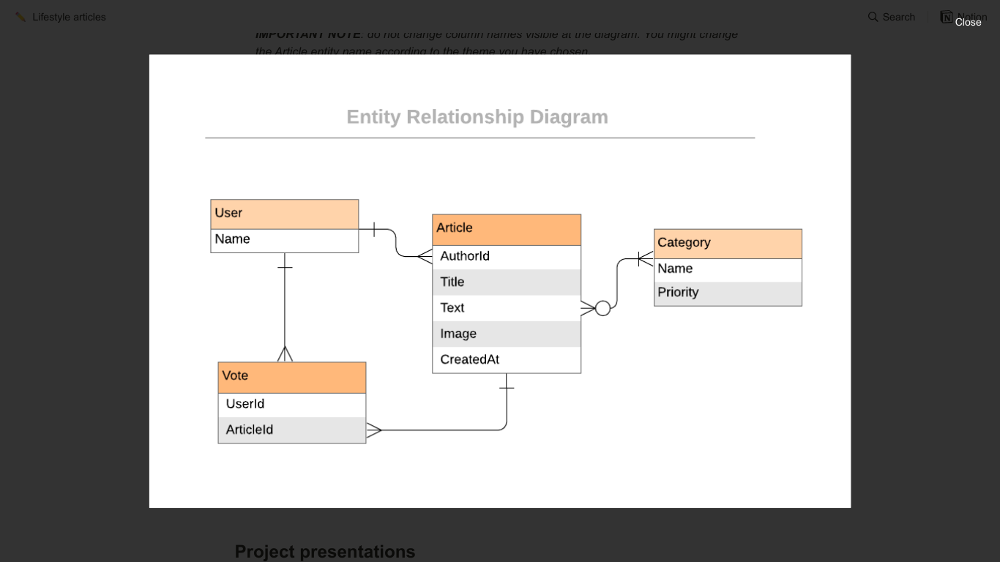

## LifeStyle Articles

  <p class="align-center">
    This project is the Capstone of the Microverse curriculum at the end of the Ruby on Rails module!
    <br />
    <a href="https://github.com/hemant-soni-vst-au4/Lifestyle_articles"><strong>Explore the docs »</strong></a>
    <br />
    <br />
    <a href="https://github.com/hemant-soni-vst-au4/Lifestyle_articles/issues">Report Bug</a>
    ·
    <a href="https://github.com/hemant-soni-vst-au4/Lifestyle_articles/issues">Request Feature</a>
  </p>
</p>

<!-- TABLE OF CONTENTS -->
## Table of Contents

* [About the Project](#about-the-project)
  * [Built With](#built-with)
  * [Walkthrough Video and Deployment (Heroku)](#walkthrough-video-and-deployment-(heroku))
* [Usage](#usage)
* [Database Structure](#database-structure)
* [Contributors](#contributors)
* [Acknowledgements](#acknowledgements)
* [License](#license)

<!-- ABOUT THE PROJECT -->
## About The Project

This is the Capstone project that signs the completion of the RubyOnRails module in Microverse Curriculum.
It is a webapp where users can register using email, username, password and can sign in with their email and password. As a logged in user, it is possible to create articles, edit profile, vote an article. Only Admin is allowed to create new category and other logged in user can create article through these category.The app can be used also on read only mode, with restricted access to its features.

### Built With
This project was built using these technologies.
* Ruby & Ruby on Rails
* Rspec / Capybara
* Bootstrap
* HTML / CSS / SCSS
* SQLite
* Bcrypt
* Rubocop

<!-- Live Demo -->
## Walkthrough Deployment (Heroku)

##
* Live Demo Link --> App Deployed with Heroku: [LifeStyle-Articles](https://evening-spire-40702.herokuapp.com/) :point_left:

## Video presentation

[](https://www.loom.com/share/05a44505c2e545c985706842a62450f5)

### Getting Started

To get a local copy up and running follow these simple example steps.

### Prerequisites

Ruby: 2.6.6
Rails: 5.2.4

### Clone
* [download](https://github.com/hemant-soni-vst-au4/Lifestyle_articles/archive/development.zip) or clone this repo:
  - Clone with SSH:
  ```
    git@github.com:hemant-soni-vst-au4/Lifestyle_articles.git
  ```
  - Clone with HTTPS
  ```
   https://github.com/hemant-soni-vst-au4/Lifestyle_articles.git

### Setup

Install gems with:

```
$ bundler install --without production
```

Setup database with:

```
$ rails db:migrate
```

### Usage

Start server with:

```
$ rails server
```

Open `http://localhost:3000/` in your browser and sing in with a user already defined --> :point_right: ```maxinova``` :point_left:
- for any technical problems running ```rails db:migrate:reset && rails db:seed``` should solve it

#### Create User

Fill the sign up form to create a user



#### Login

Use email and password



#### Homepage



#### All Articles page



#### Mobile view 

#### Home page 





  ## Automated Test

* Run the command and see the output: 
```$ bundle exec rspec```


## Database Structure
 * Database schema used for this project reflects the following structure:
 
 
 ## Potential future features
- Extend the signin / signup process to social accounts, use verfied email process
- Improve the front-end

## Authors

👤 **Hemant soni**

- Github: [@githubhandle](https://github.com/hemant-soni-vst-au4)
- Twitter: [@twitterhandle](https://twitter.com/abdelperez11)
- Linkedin: [linkedin](https://www.linkedin.com/in/hemant-soni-97427b193/)


## :handshake: Contributing

Contributions, issues and feature requests are welcome!

Feel free to check the [issues page](https://github.com/hemant-soni-vst-au4/Lifestyle_articles/issues).

## Show your support

Give a :star: if you like this project!


<!-- ACKNOWLEDGEMENTS -->
## Acknowledgements
* [Microverse](https://www.microverse.org/)
* [Ruby Documentation](https://www.ruby-lang.org/en/documentation/)
* [Ruby on Rails](https://rubyonrails.org/)
* [Bootstrap](https://getbootstrap.com/)
* [Behance](https://www.behance.net/)
* [Heroku](https://www.heroku.com/)

## Credits
* Nelson Sakwa - [liFEstIye](https://www.behance.net/gallery/14554909/liFEsTlye-Mobile-version)
* [Microverse](https://www.microverse.org/)

## 📝 License

This project is [MIT](https://opensource.org/licenses/MIT) licensed.